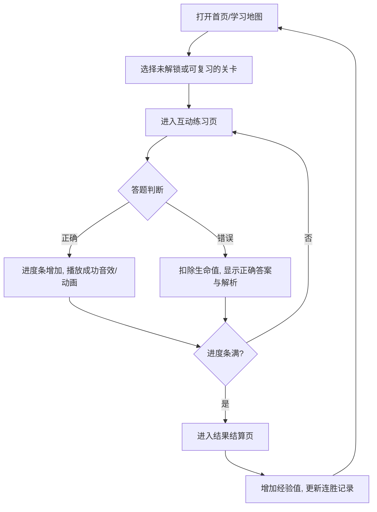

## 1. 产品概述
ChemMemo 是一个专为中学生设计的化学方程式记忆系统，采用游戏化学习机制。
- 本产品旨在解决传统死记硬背枯燥且易忘的问题，通过多元互动的练习方式（配平、填空、选择、判断），结合间隔重复算法，帮助学生灵活、长效地掌握化学方程式。
- 产品目标是让化学学习变得有趣、直观，提升学生的学习自驱力和考试成绩。

## 2. 核心功能

### 2.1 用户角色
| 角色 | 注册方式 | 核心权限 |
|------|---------------------|------------------|
| 学生用户 | 免登体验 (LocalStorage) | 浏览课程地图、进行互动练习、查看学习进度 |

### 2.2 功能模块
1. **学习地图页 (Learning Map)**：展示不同章节（如氧气、碳、酸碱盐）的关卡，解锁式学习。
2. **互动练习页 (Exercise Session)**：核心的做题界面，包含进度条、生命值，多种题型随机出现。
3. **复习错题集 (Review)**：展示薄弱的化学方程式。
4. **个人中心 (Profile)**：展示学习连胜天数、经验值(XP)、获得的徽章。

### 2.3 页面详情
| 页面名称 | 模块名称 | 功能描述 |
|-----------|-------------|---------------------|
| 学习地图页 | 章节节点 | 树状图展示学习路线，已完成节点高亮，未解锁节点置灰。 |
| 学习地图页 | 状态栏 | 顶部展示当前连胜天数、生命值、经验值(XP)。 |
| 互动练习页 | 题型展示区 | 支持“配平化学方程式”、“拖拽反应物/生成物”、“选择反应条件”、“判断对错”等题型。 |
| 互动练习页 | 提交与反馈 | 提交答案后，底部弹出大色块的正确/错误提示，并附带解析。 |
| 互动练习页 | 进度条 | 顶部显示本关卡的进度，答对增加，答错扣除生命值。 |
| 结果结算页 | 数据统计 | 展示本次练习获得的XP、正确率，提供“继续学习”按钮。 |

## 3. 核心流程
用户通过学习地图选择关卡，进入互动练习，完成多种题型的闯关，最后结算经验值并返回地图。

## 4. 用户界面设计
### 4.1 设计风格
- 主色调：活力绿（#58CC02，代表正确与生机）、辅助色（天空蓝 #1CB0F6、活力黄 #FFC800）。
- 错误提示色：珊瑚红（#FF4B4B）。
- 按钮样式：带有底部阴影的 3D 拟物化圆角按钮，点击时有按压下沉效果（类似多邻国）。
- 字体及大小：圆润可爱的非衬线字体，字号偏大，保证易读性。方程式排版需支持下标（如 H₂O）。
- 布局风格：卡片式设计，大面积留白，界面清爽，减少认知负担。
- 图标/Emoji：使用丰富且具象的 Emoji 或扁平插画（如 🧪, 💥, 💧, 🔥）辅助理解。

### 4.2 页面设计概览
| 页面名称 | 模块名称 | UI 元素 |
|-----------|-------------|-------------|
| 学习地图页 | 关卡节点 | 圆形大图标，带有皇冠或星星标识，带有连接线，整体呈现蜿蜒向上的路径。 |
| 互动练习页 | 题型卡片 | 大圆角白底卡片，包含清晰的问题描述。选项为可点击的大色块按钮或可拖拽的方块。 |
| 互动练习页 | 底部操作栏 | 宽大的“检查”按钮，根据状态改变颜色（默认灰、可点击蓝、正确绿、错误红）。 |

### 4.3 响应式
优先采用移动端（Mobile-first）布局风格，同时在桌面端保持居中显示，两侧留白或显示插画，确保在多端设备上都有良好的触控和阅读体验。
