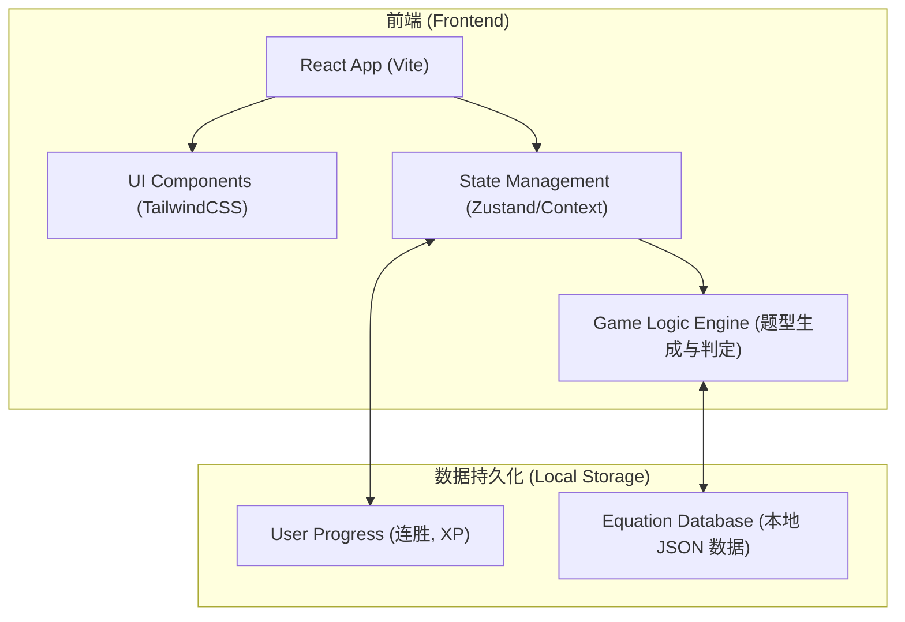

## 1. 架构设计


## 2. 技术说明
- 前端框架：React@18 + Vite
- 样式方案：TailwindCSS@3 + framer-motion (用于实现丰富的平滑动画和微交互)
- 状态管理：Zustand (用于管理生命值、经验值、当前关卡进度)
- 图标库：lucide-react 或 react-icons
- 数据存储：优先使用 LocalStorage 在浏览器端实现纯前端演示（无后端依赖），存储用户的学习记录和关卡解锁状态。

## 3. 路由定义
| 路由 | 用途 |
|-------|---------|
| `/` | 首页/学习地图页，展示关卡和学习进度 |
| `/lesson/:id` | 互动练习页，根据传入的关卡 ID 加载对应的方程式题目 |
| `/profile` | 个人中心页，展示连胜、XP和学习统计 |

## 4. 核心数据结构定义 (纯前端 JSON)
```typescript
// 方程式数据模型
interface Equation {
  id: string;
  reactants: string[]; // 反应物，如 ["2H2", "O2"]
  products: string[];  // 生成物，如 ["2H2O"]
  conditions: string;  // 反应条件，如 "点燃"
  type: 'combination' | 'decomposition' | 'displacement' | 'double_displacement'; // 反应类型
  description: string; // 解析说明
}

// 关卡数据模型
interface Level {
  id: string;
  title: string;       // 如 "氧气的性质"
  equations: string[]; // 包含的方程式 ID 列表
  isUnlocked: boolean;
  isCompleted: boolean;
}

// 题目生成模型
interface Question {
  type: 'balance' | 'predict_product' | 'match_condition' | 'true_false';
  equationId: string;
  prompt: string;
  options?: string[]; // 用于选择题
  correctAnswer: string | string[];
}
```

## 5. 交互与动画说明
- **元素拖拽**：使用 framer-motion 实现选项拖入填空框的平滑过渡。
- **正误反馈**：答对时底部弹出绿色成功面板，播放弹跳动画；答错时弹出红色面板并伴随屏幕微震动（shake animation）。
- **进度条**：使用 CSS transition 实现进度条增加时的平滑拉伸效果，并在增加时带有闪光特效。
